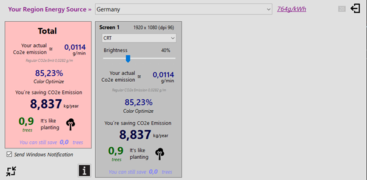
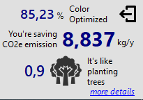
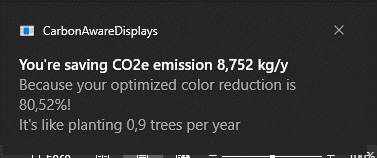

# Carbon Aware Displays

The `Carbon Aware Displays` project aims to consult end-users to choose the right color schema and display brightness dependent on user’s daytime and region, respectively the current carbon intensity of the energy to reduce carbon emissions of Displays.

It was a submission to the [CarbonHack22](https://taikai.network/en/gsf/hackathons/carbonhack22/overview).

## Quickstart / Try it out
[CarbonAwareDisplaySetup.msi](https://github.com/mgoberto/CarbonAwareDisplays/blob/d0d17f50f0df0d1140e069ba5f172ab5f4e894cc/CarbonAwareDisplaySetup.msi)

In the future, it is planned to include it in Microsoft Store

## Problem statement
Overall, the IT sector is responsible for round about 4% of global greenhouse gas emissions. 
At first glance, this may sound like a small share. But let's take a look at the average consumption of a person in Germany:
A total of 11.17 metric tons of CO2 are produced here per year per capita. 
IT's share of four percent is then still an average of 0.4 metric tons of CO2 per person per year, or 1.2 kilograms per day per German citizen.

One part of these emissions is coming from indirect emissions like the ones from data centers and the usage of networks like the Internet. 
But one of the big CO2 producers in personal and work life are our Laptops, Monitors and Mobiles.
We are sitting many hours a day in front of at least one display. Very often we are using multiple monitors.
Displays are consuming a huge amount of energy and very often are calibrated not optimal.
The configured **brightness of displays** is heavily impacting energy consumption and battery life on mobile devices.

``Reducing the brightness of a monitor from 100% to 75% can save 20% of energy ``

On top of that **different colors** are consuming different amount of energy depending on the device technology.
On OLED displays for example the so-called dark mode can drastically reduce power consumption.

``On OLED displays using dark and muted colours can save 60% of energy``

Additionally, the carbon impact of one kilowatt-hour differs by **region and daytime**. One that reason is for example solar energy is only available if the sun is shining.

| Region              | Date                              | carbon intensity per kwh |
|:--------------------|:----------------------------------|-------------------------:|
| Germany             | 2nd November 2020, 6PM |        **324** gCO2e/kwh |
| Germany             | 3rd November 2020, 2PM |        **227** gCO2e/kwh |
| Brazil (North East) | 3rd November 2020, 2PM |         **57** gCO2e/kwh |

([Source](https://app.electricitymaps.com/))

Users' need to get insights and awareness on this and require tooling to calibrate its monitor correctly to find a good match between user experience and greenhouse gas efficiency

## Solution
The `Carbon Aware Displays` application is developed in C# using the .NET framework. It is a calculator and consultant to reduce the carbon impact of Monitors and integrated Displays. On a scheduled basis (default: once a minute) it checks the brightness of the monitor and the color of each pixel. Different colors have different energy coefficients on different device types. According to this information it calculates the current energy consumption and multiplies it with associated carbon emissions of the electricity grid, where the monitor is used. The data is set into proportion to the energy that would have been used if not brightness or color reduction would have taken place. For comprehensibility it also explains the savings in user understandable units like trees or driven car kilometers

The application could be run in two different modes. First one is the normal view, also to be considered to run in background. The second one contains more details to adjust the energy consumption and CO2 savings:

A screenshot of the background view looks like this which runs in the bottom-right corner of main display:

It shows the savings based on user’s region and daytime, and the current monitor brightness and color selection. It is also ‘translated’ to number of trees

This value changes (default: once a minute) when the user changes the application on the screen. E.G switch from an application with lot of white pixels (like a text program) to a for example a website with a lot of dark and muted colors

The details’ view shows a lot more of insights and breaks the overall consumption down to the different connected monitors. Here it is also possible to configure the country’s grid emissions and the brightness of each monitor. The Carbon Aware SDK is used to source the data.

To gain even more awareness of the user to adjust the monitors configuration or turn off unused display’s, the applications sends push notification frequently (default: once an hour).

These may look like the following

## Carbon Aware SDK Integration

The project uses the carbon aware sdk to determine the current CO2 emissions by daytime and region. The data is used to calculate the current CO2 impact of each monitor and its related savings as described in previous section. It is sourced each time you changed the region in dropdown and twice an hour on scheduled base

Technically it uses the CarbonAware.WebAPI with WattTime 3rd party integration

## Impact on CO2
Displays are one important driver for the personal, IT related carbon footprint. By adjusting the brightness and color scheme it is easy to reduce it related emissions. The tool ‘Carbon Aware Displays’ helps to find a good match between usability and emission reduction. At current research state of the project, it is hard to announce final numbers. Our current estimations are showing that round about 15-30% of personal IT related emissions are display emissions (TVs, monitors, mobiles). With the adjustment of colors and brightness it is easy to half these emissions without really harming the user experience.

This is relevant for personal carbon footprint but if summed up to the number of displays worldwide it could have a serious impact to help fighting against climate change.

## Feasibility current state and nest steps

The current state of the application is publicly available here: https://github.com/mgoberto/CarbonAwareDisplays.

an installation file is located [here](https://github.com/mgoberto/CarbonAwareDisplays/blob/d0d17f50f0df0d1140e069ba5f172ab5f4e894cc/CarbonAwareDisplaySetup.msi
).

The current implementation supports Windows 10. Possible enhancements for the Windows version are:

- Integration of the brightness adjustment to the project; meaning to really change the brightness instead of just simulating and calculating the benefits

- Automatic detection of monitor type (CRT/LED/OLED) and model and its concrete individual power consumption. In current implementation it uses a dropdown to change between monitor types

- Automatic detection of user’s region. Currently, it is selected from a dropdown

- Different, alternating comparison options for of kg. of CO2. In current implementation it always shows how much the saving are in trees

- Verification with real measurements of the numbers used for color and brightness multiplication

- publication in Microsoft store

Additionally, to the enhancements on the Windows 10 version it is foreseen to migrate the concept to Linux/Mac and of course mobile applications, maybe TV’s, e.g. Android TV

## Links and further references
- [Video Pitch CarbonHack22](https://youtu.be/5-jxkqzlnrk)
- https://www.electrical4u.net/energy-calculation/led-lcd-crt-tv-plasma-tv-power-consumption/
- https://www.industr.com/de/die-rolle-der-software-beim-erreichen-von-klimazielen-2663814 
- https://www.greenlivingtips.com/articles/monitor-colors-and-electricity.html 
- https://www.scienceabc.com/innovation/does-the-dark-mode-on-the-computer-actually-save-electricity.html 
- https://www.quora.com/How-can-you-calculate-which-color-consumes-the-most-energy-from-a-display 
- https://www.researchgate.net/publication/269750337_Green_Computing_and_Energy_Consumption_Issues_in_the_Modern_Age

## License
See the [LICENSE](LICENSE.md) file for license rights and limitations (MIT).